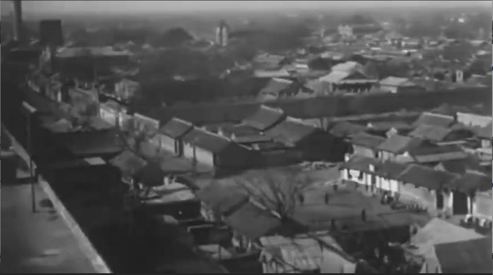
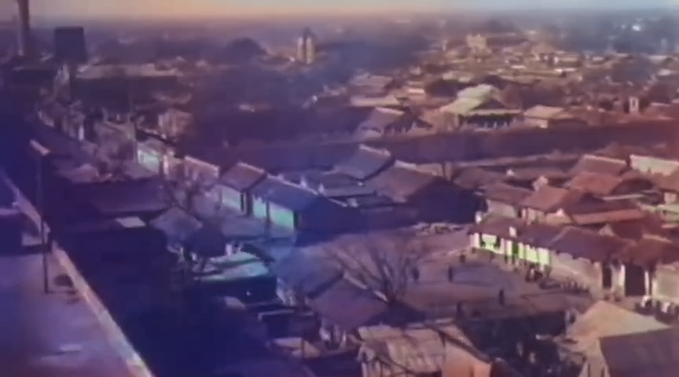
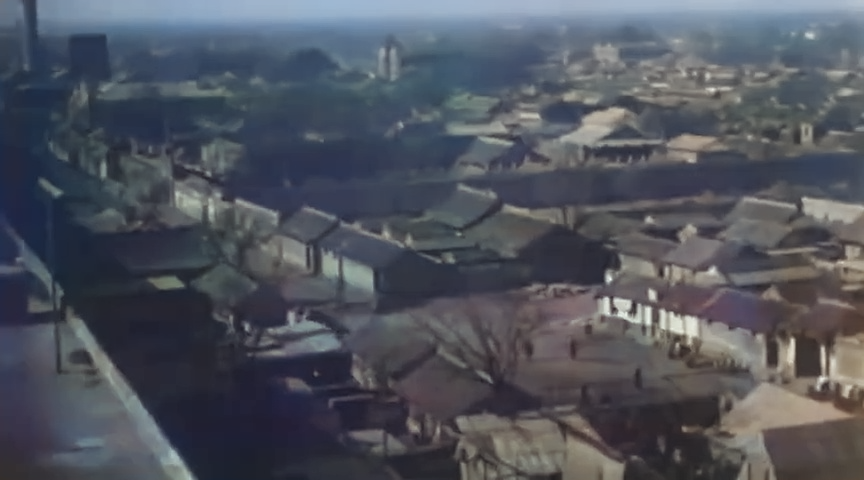
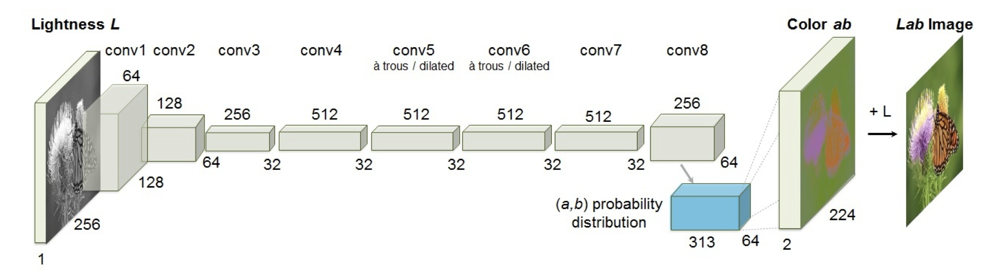

# Paddle_ImageRestoration

---

使用Paddle进行图像修复还原实现


## 一、介绍

### 1.1 预览效果

| 原图                 | eccv16                    | siggraph17                                    |
| -------------------- | ------------------------- | --------------------------------------------- |
|  |  |  |


### 1.2 网络结构




## 二、Usage用法说明

### 下载PaddlePaddle weights权重

百度网盘：[链接](/home/linxu/Desktop/Paddle_ImageRestoration/imgs/beijing.jpg)  提取码：


### 训练Train

Training script:

```shell
python train.py -bs 40 --use_gpu  
```

Evaluation script:

```shell
python train.py --use_gpu -e 0 --pretrain
```

 Please check main branch for inference


### test测试

```shell
python demo_release.py
```


## 三、参考

1. https://arxiv.org/pdf/1603.08511.pdf
2. https://arxiv.org/pdf/1805.08318.pdf
3. http://people.cs.uchicago.edu/~larsson/colorization/
4. https://github.com/gustavla/autocolorize
5. https://github.com/Phimos/Paddle-Colorization
6. https://github.com/ZMpursue/PaddleColorization
7. https://github.com/Callifrey/Paddle-CIC
8. https://github.com/nku-shengzheliu/PaddlePaddle-Colorful-Image-Colorization

